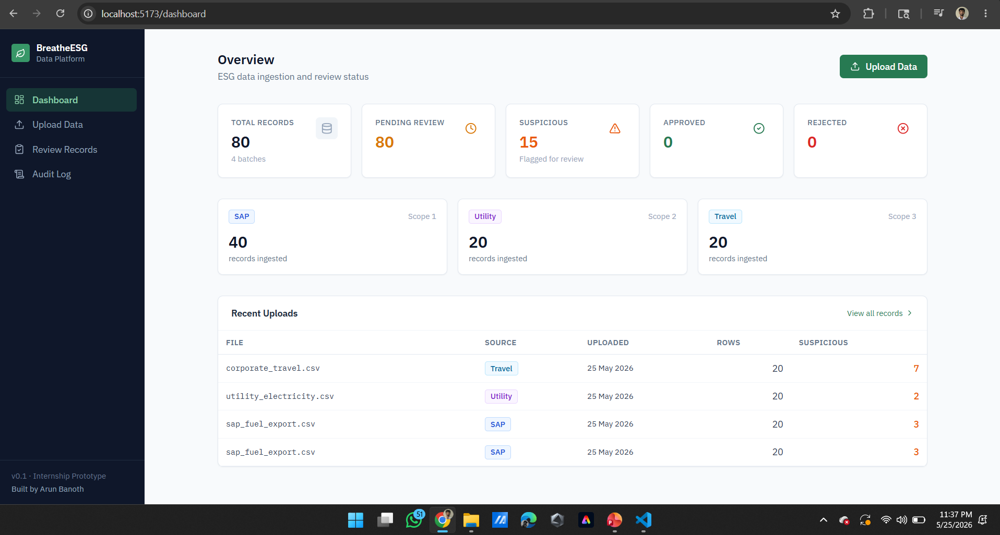
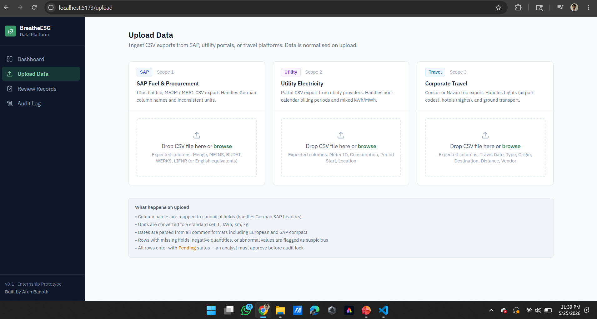
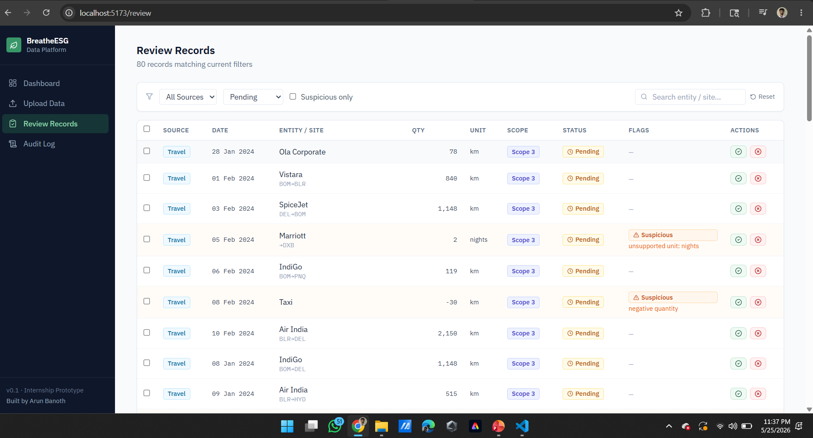
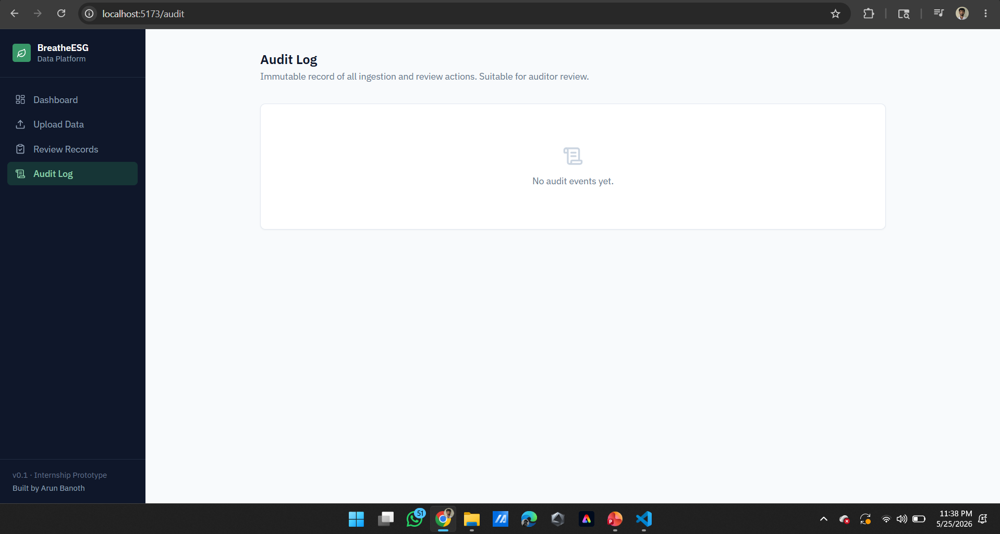

# BreatheESG — Data Ingestion & Review Platform

A prototype ESG data ingestion and analyst review platform. Handles SAP fuel/procurement exports, utility electricity data, and corporate travel data. Built with Django REST Framework + React + Vite.


---
## Screenshots

### Dashboard


### Upload Data


### Review Records


### Audit Logs

## What it does

1. **Ingests** CSV files from three enterprise sources (SAP, utility portals, Concur/Navan)
2. **Normalizes** inconsistent units, date formats, and column names
3. **Flags suspicious rows** (missing fields, negative quantities, abnormal values)
4. **Review dashboard** where analysts approve or reject records
5. **Audit trail** of every ingestion and review action

---

## Tech Stack

| Layer | Technology |
|-------|-----------|
| Backend | Django 4.2 + Django REST Framework |
| Frontend | React 18 + Vite + Tailwind CSS |
| Database | PostgreSQL |
| Fonts | IBM Plex Sans + IBM Plex Mono |

---

## Local Setup

### Prerequisites
- Python 3.11+
- Node.js 18+
- PostgreSQL 14+

### 1. Database

```bash
createdb breathe_esg
```

### 2. Backend

```bash
cd backend
python -m venv venv
source venv/bin/activate  # Windows: venv\Scripts\activate
pip install -r requirements.txt

# Create .env file
cat > .env << EOF
DJANGO_SECRET_KEY=your-dev-secret-key
DEBUG=True
DB_NAME=breathe_esg
DB_USER=postgres
DB_PASSWORD=postgres
DB_HOST=localhost
DB_PORT=5432
CORS_ALLOWED_ORIGINS=http://localhost:5173
EOF

python manage.py migrate
python manage.py runserver
```

Backend runs at `http://localhost:8000`

### 3. Frontend

```bash
cd frontend
npm install
npm run dev
```

Frontend runs at `http://localhost:5173`

---

## Folder Structure

```
breathe-esg/
├── backend/
│   ├── breathe_esg/          # Django project (settings, urls, wsgi)
│   ├── ingestion/            # Upload endpoint, 3 ingestors, models
│   │   ├── models.py         # IngestionBatch + NormalizedRecord
│   │   ├── sap_ingestor.py
│   │   ├── utility_ingestor.py
│   │   ├── travel_ingestor.py
│   │   ├── views.py
│   │   └── urls.py
│   ├── review/               # Approve/reject workflow
│   │   ├── views.py
│   │   └── urls.py
│   ├── audit/                # Immutable audit log
│   │   ├── models.py
│   │   ├── views.py
│   │   └── urls.py
│   ├── utils/
│   │   └── normalizers.py    # Pure functions: unit, date, flag logic
│   └── requirements.txt
│
├── frontend/
│   └── src/
│       ├── components/
│       │   └── ui/           # Layout, Badges, StatCard
│       ├── lib/              # api.js, utils.js
│       └── pages/            # Dashboard, Upload, Review, Audit
│
├── sample_data/
│   ├── sap_fuel_export.csv
│   ├── utility_electricity.csv
│   └── corporate_travel.csv
│
├── MODEL.md
├── DECISIONS.md
├── TRADEOFFS.md
└── SOURCES.md
```

---

## API Reference

| Method | Endpoint | Description |
|--------|----------|-------------|
| POST | `/api/ingest/upload/` | Upload CSV (multipart: source, file) |
| GET | `/api/ingest/stats/` | Dashboard summary counts |
| GET | `/api/ingest/batches/` | List all upload batches |
| GET | `/api/review/records/` | List records (filterable) |
| PATCH | `/api/review/records/:id/` | Approve or reject one record |
| POST | `/api/review/bulk/` | Bulk approve/reject by ID list |
| GET | `/api/audit/logs/` | Audit log (last 100 events) |

### Upload request

```bash
curl -X POST http://localhost:8000/api/ingest/upload/ \
  -F "source=sap" \
  -F "file=@sample_data/sap_fuel_export.csv"
```

### Review record

```bash
curl -X PATCH http://localhost:8000/api/review/records/42/ \
  -H "Content-Type: application/json" \
  -d '{"status": "approved", "reviewed_by": "saurav@breatheesg.com"}'
```

---

## Sample Data

Three realistic CSVs are provided in `sample_data/`. Each includes intentionally messy rows to demonstrate the normalization and flagging logic:

- **sap_fuel_export.csv** — German column names, European number format, mixed units (L/LT/Litres/MT/KG/GALLONS), missing quantity row, negative quantity row, abnormally large value
- **utility_electricity.csv** — Non-calendar billing periods, MWh row (converted to kWh), missing consumption, negative reading
- **corporate_travel.csv** — Mixed km/miles, missing distance, negative distance, international trips

---

## How grading criteria map to the code

| Criterion | Where it lives |
|-----------|---------------|
| Data model quality (35%) | `ingestion/models.py`, `MODEL.md` |
| Defense of decisions (25%) | `DECISIONS.md`, `TRADEOFFS.md` |
| Realistic source handling (20%) | `utils/normalizers.py`, `*_ingestor.py`, `SOURCES.md` |
| Analyst UX (10%) | `frontend/src/pages/ReviewPage.jsx` |
| What you chose not to build (10%) | `TRADEOFFS.md` |

---

## Author

**Arun Banoth**  
B.Tech in Computer Science & Engineering  
National Institute of Technology Patna
